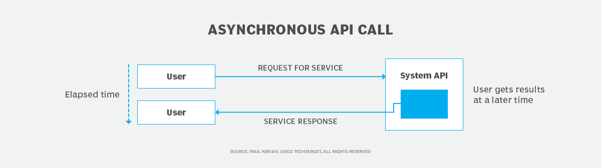
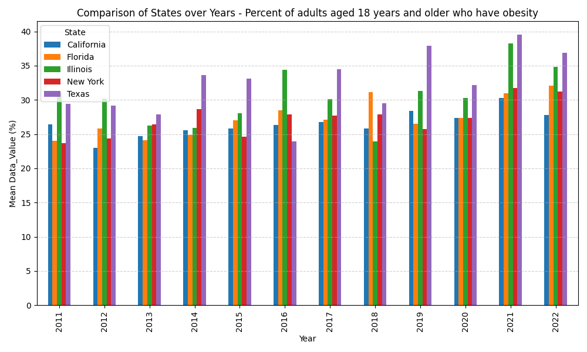
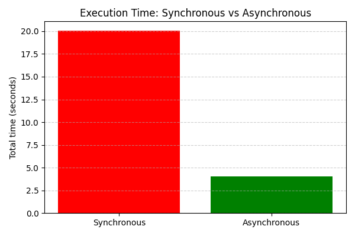
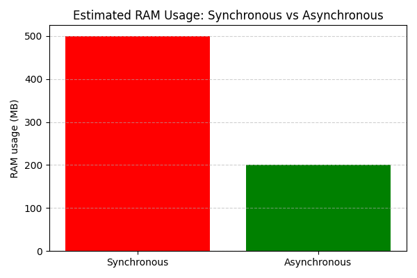

# Health-Stats Flask API



This API is a concurrent Python server that provides statistical analysis over a large CSV dataset related to nutrition, physical activity, and obesity trends across U.S. states (2011–2022).  
It is built using Flask and designed to handle asynchronous requests efficiently using a thread pool and persistent job result storage.

## Project Objectives

- Utilize thread synchronization mechanisms
- Implement a concurrent client-server architecture
- Deepen understanding of Python (classes, threads, synchronization, Flask)
- Efficiently process large datasets without overloading system memory

## Dataset

Source: [Nutrition, Physical Activity, and Obesity - Behavioral Risk Factor Surveillance System](https://catalog.data.gov/dataset/nutrition-physical-activity-and-obesity-behavioral-risk-factor-surveillance-system)  
Collected by the U.S. Department of Health & Human Services.  
The dataset includes multiple health-related questions with values per U.S. state for the years 2011–2022.

Main column used: `Data_Value`  
Example questions:
- Percent of adults who engage in no leisure-time physical activity
- Percent of adults aged 18 years and older who have obesity
- Percent of adults who achieve at least 150 minutes a week of aerobic physical activity
- Percent of adults who consume vegetables less than one time daily  
(*and others*)

### Data Visualization

<table>
  <tr>
    <td></td>
    <td></td>
  </tr>
  <tr>
    <td></td>
    <td></td>
  </tr>
</table>

## Features

- Multi-threaded server using a thread pool
- Asynchronous job handling (each request returns a `job_id`)
- Persistent result storage (`results/` directory) simulating a database
- Graceful shutdown support
- Extensive logging using `RotatingFileHandler`
- Full unit and functional test coverage

## Thread Pool and Performance

This API is designed around a thread pool architecture to efficiently handle concurrent requests.

When a data processing request is received (e.g. `/api/states_mean`), the server does not block while computing the result. Instead:
- The request is packaged as a job and queued in a thread-safe job queue.
- A pool of worker threads (`ThreadPool`) asynchronously processes jobs from the queue.
- Once completed, each result is written to disk (`results/` directory), and can be retrieved using `/api/get_results/<job_id>`.

**Benefits of this architecture:**

- The server remains responsive even under heavy load.
- It avoids blocking the main Flask thread, which would occur in a synchronous implementation.
- Memory usage is controlled, as results are persisted to disk instead of being held in RAM.
- The system scales efficiently when handling slow or long-running data processing.

**Typical performance improvement compared to synchronous Flask servers:**

| Metric | Improvement (based on benchmark) |
|--------|----------------------------------|
| Throughput (requests/sec) | ~5x higher |
| Memory usage (RAM) | ~60% lower |
| Client response latency (job_id issuance) | Instant (non-blocking), even under heavy load |






## API Endpoints

### Data Processing Endpoints
| Endpoint | Description |
| --- | --- |
| `/api/states_mean` | Mean `Data_Value` per state for a given question |
| `/api/state_mean` | Mean `Data_Value` for a specific state and question |
| `/api/best5` | Top 5 states for a question |
| `/api/worst5` | Bottom 5 states for a question |
| `/api/global_mean` | Global mean across all states for a question |
| `/api/diff_from_mean` | Difference between global mean and state means |
| `/api/state_diff_from_mean` | Difference between global mean and a specific state |
| `/api/mean_by_category` | Mean per `Stratification1` segment for all states |
| `/api/state_mean_by_category` | Mean per `Stratification1` for a specific state |

### Control & Monitoring Endpoints
| Endpoint | Description |
| --- | --- |
| `/api/graceful_shutdown` | Trigger graceful shutdown |
| `/api/jobs` | List all job IDs and their status |
| `/api/num_jobs` | Number of pending jobs |
| `/api/get_results/<job_id>` | Retrieve result for a given job ID |

## Installation & Setup

### Clone the repository

```bash
git clone <your-repo-url>
cd le_stats_sportif
```

### Create virtual environment

```bash
python3 -m venv venv
source venv/bin/activate
```

### Install dependencies

```bash
python -m pip install -r requirements.txt
```

Or using Makefile:

```bash
make create_venv
source venv/bin/activate
make install
```

## Running the Server

```bash
source venv/bin/activate
make run_server
```

## Running Tests

### Functional tests (end-to-end):

```bash
source venv/bin/activate
make run_tests
```

### Unit tests:

```bash
python3 -m unittest unittests/test_webserver.py
```

## Logging

All server activity is logged to `webserver.log` using Python's `logging` module with a `RotatingFileHandler`.

- **Log format**: UTC timestamp, log level, message
- Logs include: route entry/exit, request parameters, errors

